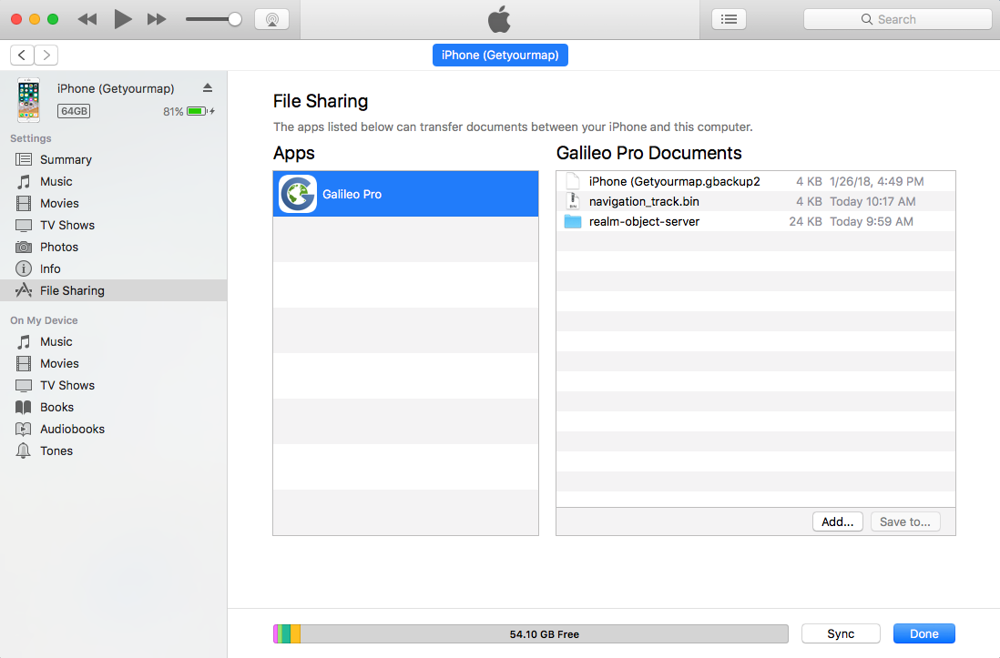

# Tips and Tricks and Troubleshooting

> In this section we will go over some of the advanced features as they pertain to specific areas of using an app.

#### Troubleshooting

Sometimes you can see empty map areas (tiles), with the following warning messages on the map:

* "Tile loading error. Please check your Internet connection" – this appears when tiles are missing in the cache and app can't download them. Enable an Internet connection or go to ’online’ mode to load the missing tiles.
* "Tile loading error. Wrong response from the server" – the online server is not responding. Try to navigate to this area later to reload any missing tiles.

## Offline Maps Import {#offlineMapsImport}

A feature, available as an in-app purchase, allows you to import previously created custom offline maps in **.sqlitedb** or **.mbtiles** format.

#### Creating an offline map

The main idea is to create an offline map for the desired area in advance with one of the following tools on your computer using one of the following tools:

* [Mobile Atlas Creator](http://mobac.sourceforge.net/) (known also as MOBAC)
* [TileMill](https://tilemill-project.github.io/tilemill/)
* [SAS.Planet](http://sasgis.ru/sasplaneta/)

_Mobile Atlas Creator (MOBAC)_ – is free software that allows you to download maps from numerous map sources, and save them in the .sqlitedb format used by Guru Maps. This tool is compatible with Windows, Mac OS X and Linux.

Reference: to learn how to create offline maps in **.sqlitedb** format, please refer to the [MOBAC manual](http://mobac.sourceforge.net/quickstart/).
				
_TileMill (by MapBox)_ – is a desktop application for cartographers to quickly and easily design and create stunning offline maps in the .mbtiles format supported by Guru Maps. It is completely compatible with Mac OS X, Windows and Ubuntu.

Reference: to learn how to create offline maps in **.mbtiles** format, please refer to the [TileMill manual](https://tilemill-project.github.io/tilemill/docs/manual/).
					
SAS.Planet – is a program designed for viewing and downloading high-resolution satellite imagery and conventional maps in .sqlitedb format.
Reference: to learn how to create offline maps in **.sqlitedb** format, please refer to the [SAS.Planet manual](http://www.sasgis.org/wikisasiya/doku.php).

#### Importing offline maps

Once you have created an offline map, you should upload it to your device. There are two ways to import an offline map into your device: via iTunes or cloud service.
						
**Importing using iTunes**

Connect your device to your computer and perform these steps:
1. Launch the iTunes application and select your device.
2. Open File Sharing in the left sidebar and select Guru in the Apps list.
3. Add the file to the offline map into the Guru Documents.

**Importing from the Files app**

In addition to iTunes sync, there is another handy way to upload your offline maps using the iOS Files app:
1. Put the file with the created offline map, in .sqlitedb/.mbtiles format, in the Files/iCloud drive on your computer.
2. Open the Files app on your iOS device and wait until the file you placed there is synchronized automatically between the devices.
3. Select the offline map you would like to import and tap the  icon, then select "Copy to Guru Maps" option to initiate the import process.

#### Using offline maps

Go to Map Source in app settings and select the imported map name in the list and back to the map view. If you are not over the area with an offline map, tap the green arrow indicating the direction to the offline map. Zoom in to see a detailed view of your offline map.

## Getting Exported Files {#GettingExportedFiles}

In order to access the exported collection, bookmark or GPS track using File Sharing:
						
1. Launch the iTunes application and select your device.
2. Open File Sharing in the left sidebar and select Guru in the Apps list to view a list of the files exported within the app on your iOS device.
3. Select the file you want to copy to your computer from the Documents list and click the "Save to.." button.
4. Locate the folder on your computer to which you want to copy a selected file and click the Open button. The selected files will be copied to your computer immediately.

					
#### Hidden Settings

Hidden settings are tweaks which have been developed to adapt the behavior and appearance of the application to your specific way of use. To access them, just go to the system Settings, scroll down and find the Guru in the app list.
The following additional settings are available for Guru:

* **Allow overzoom on map**. If enabled, the map can be zoomed closer than the scale allows.
* **Allow map rotation**. If enabled, the app recognizes the map rotation using two fingers gesture.
* **Cluster bookmarks**. If enabled, the app groups bookmarks which are close to each other on the map.
* **GPS Activity Type**. Turn set GPS activity type up depending on your needs. To read more about the options follow this link: Activity Types.	
* **Write GPS log**. Turn on to log all received GPS coordinates in order to facilitate debugging during the development process.

